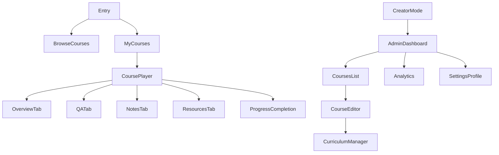

# 05 — Developer handoff (responsive + a11y + states)

This is the implementation-facing spec for building the UI described in:

- `01-mockup-audit.md`
- `02-design-system.md`
- `03-learner-experience.md`
- `04-admin-experience.md`

## Information architecture (high level)

---

## Responsive rules (non-negotiable)

### Breakpoints

- Mobile: ≤ 480px
- Tablet: 481–1024px
- Desktop: ≥ 1024px

### Course player layout rules

- Desktop: **LeftRail + Main + RightLessonPanel**
- Tablet: RightLessonPanel becomes a **drawer**
- Mobile: LessonPanel becomes a **bottom sheet** (peek/half/full)

### Touch vs pointer

- Mobile: primary interactions must be reachable with thumb; put primary CTA in sticky footer when editing/admin.
- Desktop: add hover states; preserve visible focus states for keyboard.

---

## Accessibility (web)

### Contrast targets

- Normal text: ≥ 4.5:1
- Large text (≥ 18pt regular / 14pt bold): ≥ 3:1
- Non-text UI controls: ≥ 3:1

### Keyboard navigation

- All interactive elements reachable by Tab.
- Provide visible focus ring (2px, primary tint).
- Bottom sheet and modal:
  - trap focus inside while open
  - Escape closes
  - Return focus to trigger on close

### Screen reader semantics

- Lesson list: use `<ul>`/`<li>` or ARIA list semantics.
- Current lesson: `aria-current="true"` on the now watching row.
- Progress bars: `role="progressbar"` with `aria-valuenow`, `aria-valuemin`, `aria-valuemax`.
- Tabs: use proper tab semantics (`role="tablist"`, `role="tab"`, `role="tabpanel"`).

### Motion sensitivity

- Keep animations subtle; respect `prefers-reduced-motion`.

---

## Component state checklist (build parity with design)

### Button

- default / hover / pressed / disabled / loading
- keyboard focus visible

### Input (incl. search)

- default / hover / focused / filled / error / disabled
- error message text + icon optional (but consistent)

### Tabs / segmented control

- selected / unselected / disabled
- keyboard navigation (arrow keys) for accessibility

### LessonRow

Statuses:
- locked / available / in_progress / completed / now_watching

Interaction states:
- hover (desktop) / pressed (mobile) / focused / disabled

### Bottom sheet

- closed / peek / half / full
- drag handle
- scroll locking (body does not scroll behind)

### Toast

- success / warning / error
- dismissal (auto + manual)

### Empty / loading / error states

Every major screen must define these 3:

- **Loading**: skeletons (cards, lesson rows, charts) instead of spinners where possible.
- **Empty**: clear copy + single primary CTA.
- **Error**: human-readable message + retry + support link (if available).

---

## Data/logic contracts (UI expectations)

These are UI-facing requirements that the backend/API should support.

### Lesson model (minimum)

- `id`
- `title`
- `durationSeconds`
- `isLocked`
- `progressPercent` (0–100)
- `completedAt?`

Derived UI state:
- `locked` if `isLocked`
- `completed` if `progressPercent >= 100` or `completedAt` exists
- `in_progress` if `0 < progressPercent < 100`
- `available` otherwise
- `now_watching` is client-selected (current lesson id)

### Course progress

- `completedLessonsCount`
- `totalLessonsCount`
- `courseProgressPercent`
- `lastPlayedLessonId?`
- `lastPlayedTimestampSeconds?`

### Analytics (admin)

- Sales time series (date → revenue, purchases, refunds)
- Enrollment counts
- Active learners (7d/30d)
- Progress distribution buckets

---

## Copy tone guidelines

- Short, calm, premium
- Avoid shouting (no ALL CAPS)
- Prefer “Try again” over “Error occurred”

Examples:
- Empty notes: “No notes yet. Add one while you watch.”
- Locked lesson: “Complete the previous lesson to unlock.”
- Upload error: “Upload failed. Check your connection and try again.”

---

## QA / acceptance checklist

Learner:
- Resume always opens last played lesson at correct timestamp
- Lesson status pills match state model
- Course completion triggers rating/certificate actions correctly

Admin:
- Draft/publish lifecycle is clear and guarded by checklist
- Curriculum reorder is reliable (optimistic UI + rollback on fail)
- Analytics charts handle empty ranges without breaking layout

